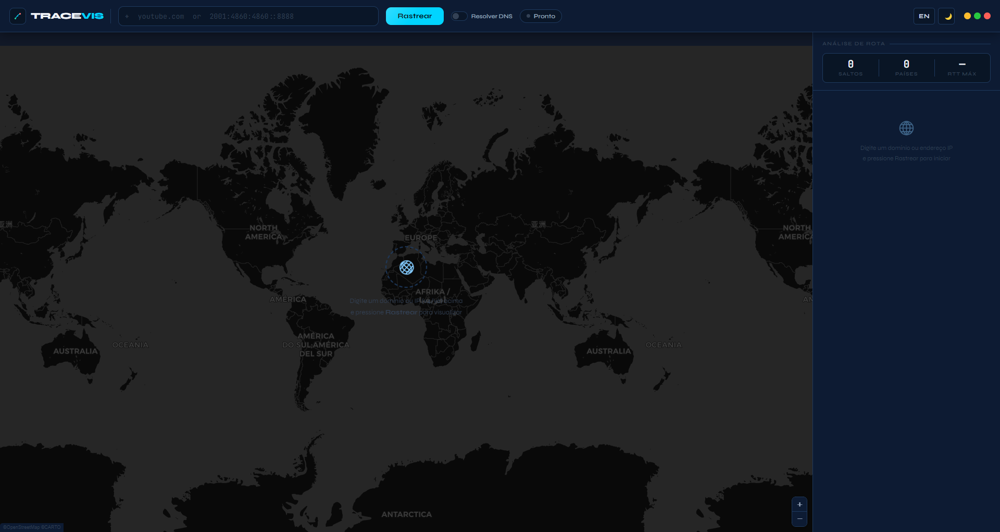
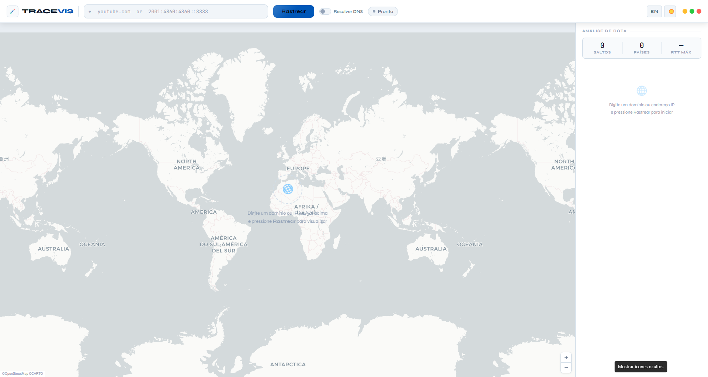

<div align="center">
  

  <h1>🌐 TraceVis</h1>
  <p><b>Visual Traceroute & Network Intelligence Dashboard</b></p>

  <p>
    <a href="https://github.com/JP-Redes/TraceVis/releases/latest"></a>
    <a href="LICENSE"></a>
    
  </p>
</div>

---

## 📖 Sobre o Projeto

O **TraceVis** é uma ferramenta de diagnóstico de rede que transforma o comando tradicional de `traceroute` em uma experiência visual rica e interativa. Construído com **Electron** e **Leaflet**, ele mapeia geograficamente cada "salto" (hop) de dados da sua máquina até o servidor de destino em tempo real.

### ✨ Funcionalidades Principais

* **🗺️ Mapeamento Geográfico em Tempo Real:** Visualize a rota dos seus pacotes de dados em um mapa interativo com animações fluidas.
* **🌗 Temas Modernos:** Suporte nativo para Modo Escuro e Modo Claro.
* **🌍 Suporte IPv4 e IPv6:** Identificação inteligente de IPs, incluindo redes locais e privadas.
* **🌐 Resolução DNS:** Alterne facilmente entre visualizar endereços IP puros ou resolver os nomes de host (Hostnames).
* **🇧🇷 Multilíngue:** Interface totalmente traduzida para Inglês (EN) e Português (PT).
* **📊 Análise Detalhada:** Informações completas de cada salto, incluindo provedor (ISP), ASN, tempo de resposta (RTT) e país.

---

## 📸 Interface

<div align="center">
  
  
</div>

---

## 🚀 Como Baixar e Usar

A forma mais fácil de usar o TraceVis é baixando a versão compilada para o seu sistema operacional.

1. Acesse a página de [Releases](../../releases).
2. Baixe o instalador correspondente ao seu sistema:
   * **Windows:** `.exe` (Instalador ou Portable)
   * **macOS:** `.dmg`
   * **Linux:** `.AppImage` ou `.deb`

> **Aviso para usuários macOS:** Como o aplicativo não possui uma assinatura paga da Apple, o sistema pode exibir um aviso de segurança. Para abrir, clique com o botão direito no `.dmg` e selecione **Abrir**.

---

## 🛠️ Para Desenvolvedores (Build e Execução)

Se você deseja modificar o código, estudar a arquitetura ou compilar o projeto você mesmo, siga os passos abaixo.

### Pré-requisitos
* [Node.js](https://nodejs.org/) (Versão 18 LTS ou superior)
* Permissões de administrador (Windows) ou `sudo` (Linux) para execução do traceroute.

### 1. Instalação e Execução Local

Clone o repositório e instale as dependências:

```markdown
git clone https://github.com/JP-Redes/TraceVis.git
cd TraceVis
npm install
````

Para rodar em modo de desenvolvimento:

```bash
npm start
```

### 2\. Gerando as Builds (Compilação)

O projeto utiliza o `electron-builder` para gerar os executáveis.

#### 🪟 Windows

Descubra a arquitetura do seu PC (`Win + R` \> `msinfo32` \> "Tipo de sistema").

```bash
npm run build:win:x64    # PC Intel/AMD 64 bits (Maioria)
npm run build:win:ia32   # PC Intel/AMD 32 bits
npm run build:win:arm64  # Processadores ARM
npm run build:win:all    # Todas as arquiteturas
```

*Para versões que rodam sem instalar, troque `win` por `portable` (ex: `npm run build:portable:x64`).*

#### 🐧 Linux

```bash
npm run build:linux       # Gera AppImage, deb e rpm para x64
npm run build:linux:arm64 # Para arquitetura ARM
```

#### 🍏 macOS

```bash
npm run build:mac           # Intel x64
npm run build:mac:arm64     # Apple Silicon (M1/M2/M3)
```

-----

## ⚠️ Solução de Problemas

**"Este aplicativo não pode ser executado em seu PC" (Windows)** - Você baixou/compilou a arquitetura errada. Verifique se seu Windows é x64, ia32 ou arm64 e use o comando correspondente.
**"tracert não encontrado" (Windows)** - Execute o aplicativo como Administrador.
**O mapa não mostra os saltos (Linux)** - O comando traceroute precisa de elevação de privilégio. No terminal, rode: `sudo setcap cap_net_raw+ep $(which traceroute)`
**"traceroute: command not found" (Linux)** - Instale a ferramenta de rede do seu sistema. Ubuntu/Debian: `sudo apt install traceroute`. Fedora: `sudo dnf install traceroute`.

-----

## 💻 Tecnologias Utilizadas

  * **Front-end:** HTML5, CSS3 (Variáveis nativas e Flexbox/Grid), JavaScript Vanilla.
  * **Back-end/Desktop:** [Electron](https://www.electronjs.org/)
  * **Mapas e Geoprocessamento:** [Leaflet.js](https://leafletjs.com/)
  * **Fontes:** Syne & JetBrains Mono

-----

## 📜 Licença

Este projeto está sob a licença MIT. Veja o arquivo [LICENSE](https://github.com/JP-Redes/TraceVis/blob/main/LICENSE) para mais detalhes. Você é livre para usar, modificar e distribuir este software.

<div align="center">
  <p>Desenvolvido com dedicação por João Pedro.</p>
</div>
